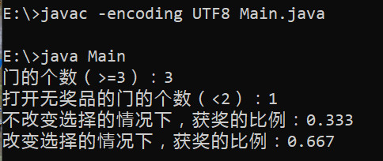
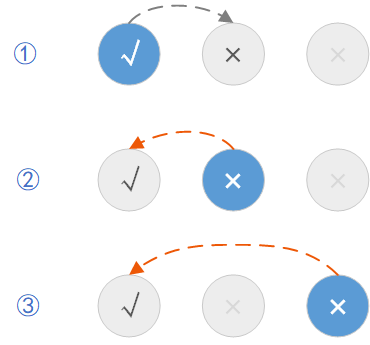
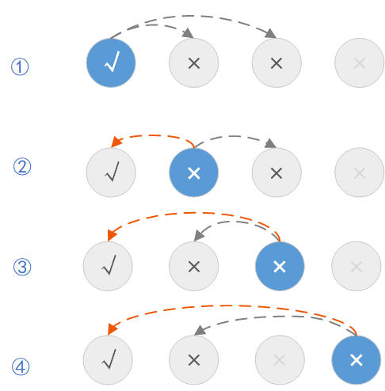
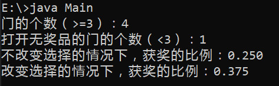

16061200

> 3.1 在一个游戏中，主办方在三个门中任选一个，在门后放了一个奖品，另外两个门之后是空的。选手要在三个门中选择一个抽奖。 当选手选择了一个门，未曾打开门之前，主办方打开了另外两个门中没有奖品的那个门，并向选手说， 他可以改变他的选择，即转为选择剩下一个没有打开的门。 请问，如果选手此时改变选择， 他会提高或降低获奖的可能性么？提高多少？请给出你的分析。 写完你的回答后， 你就可以提交 （submit）文件到你的Github中，大家就能在github上看到这个文件的提交记录。这个部分写在上述的 Markdown 文件中。

如果选手改变选择，获奖的可能性会提高到2/3，原来获奖的可能性是1/3，所以提高了1/3。

###### 1. 程序模拟

在分析之前，先写一个程序模拟一下，计算获奖的比例。程序源文件是本目录下的Main.java。运行程序得到下面的结果。

可以看出，如果选手**始终不改变选择**，获奖的可能性是1/3，这与从三个门中任选一个的概率相同；如果选手**始终改变选择**，获奖的可能性是2/3。

###### 2. 特例分析1

在只有3个门的情况下，选手改变选择，由于只有3个门，其中一个被打开了，另一个已经被选择了，所以只有一种可能性，如下图所示。

- 每个圆圈代表一扇门，圆圈里为√表示有奖品，为×表示没有奖品。
- 蓝色表示已经被选手选择，例如第一行最左边。
- 暗淡的表示已经被打开，不会再被选手选择，例如第一行最右边。
- 浅灰色圆圈深色√或×表示未被打开的，且没有被选手选择的门，例如第一行中间的圆圈。如果选手要改变选择，就只能选择这样的圆圈。

1. 首先，一开始选手有3种选择，如图中的每一行表示一种情况，此时，选手有1/3的概率获得奖品。
2. 然后，有一扇不含奖品的门被打开了，从图中可以看出，不论选手一开始选择了哪扇门，总能找到不含奖品的一扇门。
3. 现在，选手有3种选择。第一种是不改变选择，那么这种情况下获奖的概率与门没有被打开时的概率相同，仍然是1/3。第二种是改变选择，在剩余的两扇门中重新**随机选择**一扇门，这种情况没有利用到*主办方打开不含奖品的门*这个信息，显然，获奖的概率是1/2。最后一种，同样是改变选择，但选择的是如图中第一行中间的那种圆圈，也就是放弃已选择的，选择剩下的未被打开的门。

最后一种情况获奖的概率是多少呢？在只有3扇门的情况下，选手若要改变选择，他的选择是唯一的，只能选择如图中第一行中间的那种圆圈。观察下图中的每一行，发现选手在②③两种情况下能由错误的选择变为正确的选择，在情况①由正确的选择变为错误的选择。这里说的正确的选择就是选择了一扇有奖品的门。由此可以得出，选手获奖的概率是2/3。

###### 3.特例分析2

如果是4扇门而不是3扇门，选手如果每次都改变选择，获奖的概率是多少呢？还是按照前面的分析方法，绘制下图。

从图中看出，一共有8中可能的情况，其中3种情况（用橙色箭头标出）最终选择了有奖品的门，所以获奖的概率是3/8。用之前的程序进行验证，如下图，比例确实是3/8。

###### 4. 更一般的情况

假设有n扇门（n>=3），其中只有1扇门后有奖品。选手选择一扇门后，主办方打开k扇没有奖品的门（k<n-1），此时选手改变选择，随机从剩下的n-k-1扇门中选择一扇门。

- 一开始**选择错误**的概率是(n-1)/n，例如第一个特例里有2/3的概率选择②③，然后打开了k扇没有奖品的门，此时如果改变选择，只能在剩下的(n-k-1)扇门中选择，这(n-k-1)扇门中**必有1扇门背后含有奖品**，所以选到含有奖品的门的概率是1/(n-k-1)。
- 一开始**选择正确**的概率是1/n，例如第一个特例里有1/3的概率选择①，然后打开了k扇没有奖品的门，此时如果改变选择，只能在剩下的(n-k-1)扇门中选择，这(n-k-1)扇门中**任何一扇门背后都不含有奖品**，所以选到含有奖品的门的概率是0。

那么，最后获奖的概率就是(n-1)/n * 1/(n-k-1) + 1/n * 0 = (n-1)/n(n-k-1)

> 3.2 如何看待 “中文房间” 问题，中文房间有智能么？它有什么样水平的智能？如何才能让它具有人类水平的智能？ 参见 [中文房间问题资料](https://www.bing.com/search?setmkt=zh-CN&q=%E4%B8%AD%E6%96%87%E6%88%BF%E9%97%B4+%E9%97%AE%E9%A2%98)

我认为中文房间有智能，不过智能的水平非常低下。

中文房间根据一系列的规则来运行，回答中文问题。对于人类来说，中文房间还不能给出一个令人满意的回答。说中文房间是否具有智能，这里的智能是相对于人来说的，也就是说，中文房间与人相比，有着几成的智能。人自然不愿意承认中文房间有着多么高的智能，无论中文房间是否理解问题的语义。

看类似的一个例子。假设有这样一个机器人，主人不在家中时，如果家里着火了，这个机器人能开门，并敲门通知邻居来灭火。这样一个固定的程序可能是由人事先设定好的。我们会认为这个机器人具有智能吗？可能机器人只知道该怎么做，不知道为什么要这么做，它不知道着火会带来什么样的后果。就像人对一些问题知其然而不知其所以然一样。我们可能说这个机器人是不具有智能的。设想另一种情况，仅仅把机器人换成狗。狗发现着火了，会打开门，狂叫着引起邻居的注意，然后邻居来灭火。这在结果上与机器人是相同的。没有人告诉狗如何开锁，但它通过观察主人的动作学习到如何开锁，它也知道火会造成什么样的后果。我们认为狗是具有智能的。这两种情况结果都相同，过程不同。是根据结果还是过程来判定是否具有智能呢？

我们还不能给出理解的准确的定义，什么样就算理解语义了？即使人有时都会有不理解问题的时候，但人也可以记住问题的答案，这样算智能吗。如果智能的判定要以人为标准，未免有些苛刻。或许可以给一个分数，表示智能的程度，就像考试一样，低于60分就算作不及格，智能程度的分数低于某个值就不算做智能了。所以中文房间还是有一定的智能的，只是这种智能跟人类相比，太微不足道了。

> 3.3 既然这门课讲了很多计算机前沿，那么学生就可以预计一下这些前沿知识如何能给普通用户或某个行业带来好处。 学生根据讲课的内容和参考文献，用 [NABCD](https://www.cnblogs.com/xinz/archive/2010/12/01/1893323.html) 的模板，描述你心目中一个使用了 “人工智能+其他前沿技术” 的创新项目。 这个项目应该是由 7 - 10 名有相关技能的大学生在 4 个月能完成。 写完项目提案后，就可以提交 （submit）到你的github 账户中，你可以在github 上看到这个文件的提交记录。你可以提交多次，但是要记住一定要把最后的版本提交上来。这个部分也写在同一个文件中。

###### Need:

有的大学对学生的体育锻炼有要求，例如在北航，学生需要在一学期内到田径场、游泳馆等锻炼场所刷卡48次。但很多同学只刷卡不锻炼，学校的田径场只有一个出入口，为了让同学多锻炼，刷卡机设置到了离田径场出入口最远的对角线上。为了让学生能够真正锻炼，学校希望取消手动刷卡的机制，能够自动识别学生的锻炼情况，并登记在系统中。

###### Approach:

使用田径场上的监控摄像头，利用RFID技术，结合人工智能算法，识别学生身份，追踪学生的锻炼情况。

###### Benefit：

学生不用手动刷卡，从而专心于体育运动中。学校能让学生真正地进行锻炼，避免只刷卡不锻炼的情况。

###### Competitor:

目前还没有做类似产品的竞争对手。

###### Delivery:

用户主要是各个大学。直接与各个大学联系即可。